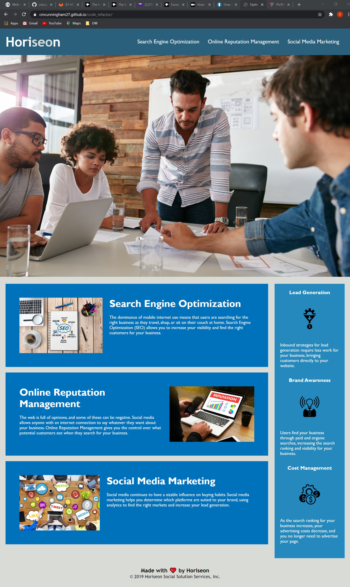

# Code Refactor

## About the Project

&nbsp;

#### The Horiseon Marketing Agency is providing this website to help business owners understand different strategies they can utilize to increase their marketing abilities.

&nbsp;

#### Horiseon wanted their codebase to follow accessibility standards in order to make their own website optimized for search engines.

&nbsp;

#### To accomplish this I added alt attributes to images and internal links, provided semantic structures, condensed the CSS selectors, and made sure all links worked accordingly.

---

&nbsp;

## The following image shows the web application's appearance

&nbsp;

---
&nbsp;
## Links

&nbsp;

[Deployed Application URL]( https://cmcunningham27.github.io/code_refactor/)

[GitHub Repository URL](https://github.com/cmcunningham27/code_refactor)
